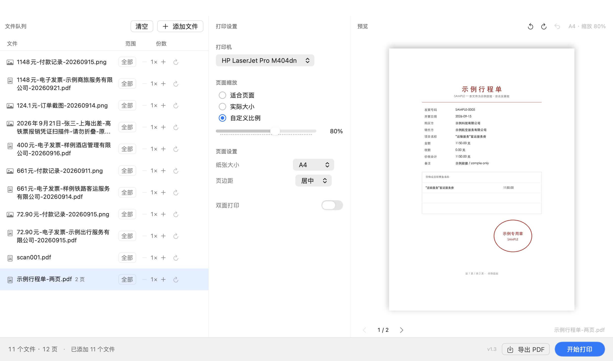

# BatchPrint · 批量打印工具

A small native macOS app for printing a batch of files under one set of rules.

Drop in a folder of receipts, invoices, tickets or screenshots, set the scale and paper
once, then send the whole queue to the printer as a single job. It was written for the
month-end expenses case — 80% scale by default so nothing gets clipped when the pages are
bound, centered on A4, and filenames that stay readable while you check the list.



## What it does

- **One queue, many formats** — PDF, images (PNG / JPG / JPEG / TIFF / GIF / BMP / HEIC / HEIF / WEBP)
  and Office or text files (doc/docx, xls/xlsx, ppt/pptx, odt/ods/odp, rtf, txt, csv).
- **One set of rules** — scale (fit / actual size / custom 50–100%), paper (A4 / Letter / A5),
  margins, duplex.
- **Per-file overrides** — page range, copies, and rotation, each file on its own.
- **Live preview** — the selected file is re-rendered with the current settings as you change them.
- **Export instead of printing** — write the scaled PDFs to a folder first and check the layout.
- **Built as a print queue, not a file manager** — the list answers "what am I about to print,
  and which files have settings that differ from the default".

More states: [`screenshots/`](screenshots) — default, hover, rotated, changed settings, dark mode, empty.

## Requirements

- **macOS 26 (Tahoe) or later.** The UI uses `glassEffect` and `containerBackground`, so it
  neither builds nor runs on earlier versions.
- **Apple Silicon.** The build target is `arm64-apple-macos26.0`; Intel isn't tested.
- Optional: **LibreOffice**, only if you want to print Office or text files. Without it those
  files are skipped when you add them.

## Install

1. Download `BatchPrint-1.3.dmg` from the [latest release](../../releases/latest) and open it.
2. Drag the app into `Applications`.
3. **First launch:** the app is ad-hoc signed, not notarized — notarization needs a paid Apple
   Developer account. macOS will refuse to open it the usual way. Either:
   - right-click the app → **Open** → **Open**, or
   - run `xattr -dr com.apple.quarantine "/Applications/批量打印工具.app"`

   If you would rather not bypass Gatekeeper, build it yourself with `./build.sh --install`
   and skip the download.

## Build from source

```bash
./build.sh              # → dist/批量打印工具.app
./build.sh --install    # also installs to ~/Applications and opens it
./build.sh --package    # also produces dist/BatchPrint-<version>.dmg and .zip
```

You need Xcode or the Command Line Tools for the macOS 26 SDK; the script locates the SDK by
itself (`xcrun --show-sdk-path`). `VERSION=`, `BUILD_NUM=`, `ARCH=` and `SDK=` override the defaults.

## Notes

- Printing goes through CUPS `lp`. The app does the scaling itself while building the PDF
  instead of relying on driver-side scaling, which varies between printers.
- The preview, the export and the print job share one PDF pipeline, so what you see in the
  preview is what comes out of the printer.
- No telemetry and no network calls. Files are read locally and never modified.

---

以下是中文开发文档。

## 功能

- **多文件类型**：PDF、图片（PNG / JPG / JPEG / TIFF / GIF / BMP / HEIC / HEIF / WEBP）、Office 与文本（doc docx xls xlsx ppt pptx odt ods odp rtf txt csv）
- **加文件只有一个入口**：拖拽 / `⌘O` / 空状态和顶部的「添加文件」。同一个面板里**文件和文件夹都能选**（选文件夹就把它里面支持的文件一次全加进来）
- **统一缩放**：实际大小 / 适合页面 / 自定义比例（滑块 50–100%）
- **纸张与页边距**：A4 / Letter / A5；页边距 无 / 居中
- **逐文件控制**：页码范围（`全部` / `1-3` / `1,3,5`，非法输入红框提示）、份数（`− 1× +` 步进器）
- **实时预览**：选定文件按当前缩放实时渲染，多页可翻页
- **队列信息层级**：队列栏只有「文件 + 范围 + 份数」三样常驻。文件名**折两行显示、不截断**（旧的 页数/旋转/状态/删除 四列常驻合计占掉 180pt，把文件名挤到只剩 43–80pt，名字全被截成 `72.9....pdf`）
- **旋转**：行尾就是一个按钮，点一下 +90°，可以一直点：`↻` → `↻90°` → `↻180°` → `↻270°` → `↻`（每行独立）；**⌥ 点击 = 逆时针 90°**（只写在 tooltip 里，不占宽度）。角度直接显示在按钮上，所以「状态」和「入口」是同一个东西。完整动作（左转/右转/复位/在访达中显示）在**行右键菜单**；预览头部还有一对常驻的左右旋转按钮（作用于当前选中文件）
- **静默原则**：机器事实静默、用户决定常显。正常行不写「就绪」、单页文件不写页数；`范围`/`份数`/`旋转` 一旦偏离默认值就变蓝
- **旋转时预览跟着跳**：在任意行上旋转会同时把该行设为选中，否则预览不跳过去、看不到转动效果
- **双面打印**、`⌘P` 打印、`⌘O` 添加、`⌫` 移除选中
- 队列可导出为缩放后的 PDF（不打印，先验证排版）
- 浅色 / 深色模式；跟随系统「减弱动态效果」自动降级动画

## 使用

1. 把文件（或整个文件夹）拖进窗口，或点「添加文件」
2. 在中间设置区选打印机 / 缩放 / 纸张 / 页边距 / 双面
3. 逐行检查页码范围、份数与旋转，右侧预览确认效果
4. 点「导出 PDF」先落文件验证，或直接「开始打印」

## 实现要点（几个踩过的坑）

- **列宽预算先于一切**：队列栏宽度 = `max(340, 窗口宽 × 0.34)`，1120pt 窗口下只有 381pt。旧版右侧固定列（页数 44 + 页码范围 74 + 旋转 70 + 份数 56 + 状态 44 + 删除 22 + 内边距 28 = 338pt）几乎吃满整栏，**留给文件名的只剩 43pt**，`truncationMode(.middle)` 又把「电子发票 / 付款记录」这类中间段全切掉，同金额的文件互相不可区分。修法不是换截断方式，是重新分配列宽预算：右侧只留 `范围 50 + 份数 62 + 效用位 62`，文件名拿回 219pt 并允许折两行（两行约 40 个汉字，一条 39 字符的中文文件名也装得下）。
- **重叠的真凶是 pill 上的 `.frame(width: 54)`**：范围 pill 里的 `Text` 上留着旧布局的固定宽度，撑到 66pt，在 56pt 的槽里向左溢出 10pt，直接压在文件名上。看起来像「文件名太长」，实际是 pill 太宽。**修 UI 重叠时先量每一段的实际像素宽度，别靠猜。**
- **裁文本，绝不裁整个 cell**：为了防溢出，给文件名 cell 加过硬 `frame(width:) + clipped()` —— 结果**图片类型的文件图标整片消失**（`photo` 符号在 12pt 下比 `doc.richtext` 宽，cell 被硬裁后它被压成 0 宽）。正确做法：固定右侧列的宽度、让文件名列自然吃掉剩余宽度，只给 `Text` 自己加 `.clipped()`，icon 用 `.fixedSize() + frame(width:)`。这类「布局没变但符号不见了」的问题只有像素 diff 才能发现。
- **行内按钮再小一号**：`HoverButton(.mini)` 是 22pt，三枚就是 74pt。行尾密集区另开了 `RailButton`（18pt），三枚只吃 62pt —— 队列栏是硬约束，每 1pt 都要从文件名嘴里抢。
- **旋转图标用圆箭头**：`rotate.left/.right` 在 macOS 26 的 SF Symbols 里画成两个几乎一样的方块+小箭头，左右难分；改用 `arrow.counterclockwise` / `arrow.clockwise`，和状态文字里的 `↻` 字形也统一。
- **会「出现/消失」的元素会推开旁边可点的按钮**：预览头部原本是一个「↻90° · 复位」文字按钮，有旋转才出现。结果每转一次，旁边的 ↺ ↻ 就被推走一段，而鼠标正停在按钮上（连续点必然点错）。修法：**不是删元素，而是把会变的东西换成固定占位的图标** —— 复位改成第三个图标按钮，未旋转时只是发淡+禁用，位置永远不变。以后任何「状态文字」想进工具栏，都先问：它出现/消失时会推动可点区域吗。
- **旋转不另开分支**：先把内容外接盒按 90°/270° 换成宽高互换的盒子，缩放 / 纸张 / 页边距三套规则照常作用于这个盒子，绘制时再绕盒子中心旋转、并按原内容中心回移（`rotatedBox` / `placeContent`）。导出、打印、预览三条路径共用一份数学，不会出现「预览转了导出的没转」。实测四角度在纸上均居中（偏移 ≤2px），90° 后内容宽高比精确为原图倒数。
- **图片不是另一条流水线**：图片按 DPI 元数据换算成点尺寸后，用与 PDF **完全相同**的缩放/纸张/页边距数学画进 PDF，所以行为一致、只有一套逻辑。
- **Office 转换**：`soffice --headless --convert-to pdf`，按「转换器版本 + 路径 + mtime」缓存到 `~/Library/Caches/local.printtools.batchprint/office/`。
- **LibreOffice 中文乱码**：headless 模式下它在本机的字体发现是坏的（找不到系统 CJK 字体，中文渲染成空白/方块）。修法是注入一份指向 `/System/Library/Fonts` 的 `FONTCONFIG_FILE`，见 `ensureFontConfig()`。
- **渲染必须全部走同一个串行后台队列**（`renderQueue` / `renderOffMain` / `BatchPlan`）：
  ① PDF 解码、图片解码、Office → PDF（LibreOffice，1–3 秒/文件）都是**同步阻塞**的，留在主线程会让整个窗口卡住 —— 转一下旋转、预览一个 Office 文件都会顿；导出/打印的批量渲染也一样。
  ② LibreOffice 用同一个 user profile，**不能并发跑两个实例**（会抢锁），所以串行化不只是性能，是正确性。渲染参数先快照成 `BatchPlan` 再带到后台，避免竞态。
- **防抖要把「取消」当真**：预览有 60ms 防抖，但 `try? await Task.sleep` 被取消后还会继续往下跑（取消错误被 `try?` 吃掉了），连续点几次旋转就等于排队渲染几次，手感变成「点了没反应」。现在 sleep 之后和后台渲染回来之后都补了 `Task.isCancelled` 检查，旧图不会盖住新图。
- **旋转不要动画**：试过让预览图「转过去」（新图先无动画放在旧角度，再动画回 0；先弹簧、后 220ms ease-in-out），实测**生硬且多余**。旋转是精确几何变换，内容自己换了朝向已经说明一切；旋转本身是每天几十次的操作，按 animate 的 frequency 门应该近乎无感。现在只保留图本身的 opacity 交叉淡入（`easeOut 0.18s`）。
- **光标接管**：`TextField` 获得焦点后 field editor 会把全局光标置成 I-beam，而鼠标离开时没有可靠复位（`cursorUpdate` tracking area 为 0）。AppKit 每次 mousemove 又用 cursor rect 覆盖回来，所以只在事件监听里 `set()` 无效。最终做法是 `window.disableCursorRects()` **接管光标管理**，自己按命中视图决定。
- **打印**：走 CUPS 的 `lp`（macOS 自带开源打印系统），不依赖任何 GUI 打印栈。

## 视觉语言（冻结）

新增任何 UI 之前先问「它属于哪一类」，而不是每个功能单独想视觉。

| 语义 | 表现 |
|---|---|
| 默认 | 灰阶、安静（不写「就绪」、不写单页页数） |
| 当前选中 | 浅蓝背景（对应右侧预览） |
| Hover | 中性浅灰背景 + 出现 contextual action（×） |
| 偏离默认 | Accent Blue + **具体值**（`↻90°` / `1–2` / `3×`），只此一处用蓝 |
| 异常 | 红（非法页码范围） |
| 成功 | 不显示 |
| 完整 / 高级操作 | 预览头部 toolbar / 行右键菜单 |

关键约束：**蓝色只有一个含义 —— 这一行的打印结果偏离了默认。**
所以文件类型图标只用形状区分、统一灰阶，不能上彩色（否则「突然蓝一下」就不再是异常信号）。

## 已知限制

- 加入队列时 Office / 文本文件要先转换（1–3 秒/文件），整批加完才会一次性出现在列表里，底栏显示进度。图片和 PDF 没有这个问题
- 页码范围按源 PDF 页码；Office / 图片按转换后的页码
- 页数只在**多于 1 页**时以极淡尾缀跟在文件名后面（单页显示「1」是噪音）；完整页数在范围 popover 里
- 行内的 `×`（移除）按钮 **hover 才出现**（换取文件名宽度）；旋转按钮是常驻的。熟手路径：右键菜单、`⌫` 移除选中
- 没有拖拽排序、多选删除、每行独立双面设置
- 未公证（ad-hoc 签名），首次打开需要手动放行一次
- 只测过 Apple Silicon + macOS 26

## 无头自检（改了队列 / 预览后必跑）

内置快照钩子，直接跑二进制即可出图，不需要鼠标：

```bash
B="dist/批量打印工具.app/Contents/MacOS/BatchPrint"   # 或 ~/Applications/... 里的
D=/tmp/printdemo   # 放若干样本文件（含一个长文件名、一个多页 PDF、一个图片、一个 pdf）

env BATCHPRINT_SAMPLE_DIR=$D BATCHPRINT_SNAPSHOT=/tmp/s1.png "$B"                        # 默认态
env BATCHPRINT_SAMPLE_DIR=$D BATCHPRINT_HOVER_ROW=3 BATCHPRINT_SNAPSHOT=/tmp/s2.png "$B" # 只点亮第 4 行
env BATCHPRINT_SAMPLE_DIR=$D BATCHPRINT_DEMO=rotate BATCHPRINT_SNAPSHOT=/tmp/s3.png "$B" # 转过 90/270
env BATCHPRINT_SAMPLE_DIR=$D BATCHPRINT_DEMO=stress BATCHPRINT_SNAPSHOT=/tmp/s4.png "$B" # 非法范围 + 份数 3
env BATCHPRINT_SAMPLE_DIR=$D BATCHPRINT_DARK=1 BATCHPRINT_SNAPSHOT=/tmp/s5.png "$B"      # 深色
env BATCHPRINT_SNAPSHOT=/tmp/s6.png "$B"                                                 # 空态

# 批量渲染路径（导出/打印共用那条）也要能被无头验证：
# NSOpenPanel 没法自动化，所以给一个直接指定输出目录的钩子
env BATCHPRINT_SAMPLE_DIR=$D BATCHPRINT_EXPORT_DIR=/tmp/bpexp "$B"                       # 导出缩放后的 PDF
env BATCHPRINT_SAMPLE_DIR=$D BATCHPRINT_DEMO=stress BATCHPRINT_EXPORT_DIR=/tmp/bpexp "$B" # 份数 3 的行多出 -c1/-c2
```

| 变量 | 作用 |
|---|---|
| `BATCHPRINT_SAMPLE_DIR` | 启动时自动把这些文件加进队列 |
| `BATCHPRINT_SNAPSHOT` / `_DELAY` | 截图到指定路径 / 延迟秒数（默认 2.2s） |
| `BATCHPRINT_HOVER=1` | 强制**所有行**进入 hover 态（看全 hover 样式用） |
| `BATCHPRINT_HOVER_ROW=<idx>` | 只点亮第 idx 行（验证「只有鼠标所在行出现 ×」） |
| `BATCHPRINT_DEMO=rotate` / `stress` | 造出「转过 90/270」/「非法范围 + 份数 3」的状态 |
| `BATCHPRINT_DARK=1` | 深色模式 |
| `BATCHPRINT_EXPORT_DIR=<dir>` | 跳过面板直接导出到该目录 |
| `BATCHPRINT_PRINTER=<名字>` | 覆盖打印机名（做截图时用，避免带出本机设备信息） |
| `BATCHPRINT_DUMP` / `_CURSORLOG` | 打印 NSView 层级 / 光标调试日志 |

几条踩过的坑：

- `BATCHPRINT_HOVER=1` 会让**所有行**同时 hover，那不是真实行为（真实 hover 是逐行 `onHover`）；要验证「只有一行出现 ×」用 `HOVER_ROW`。
- `SNAPSHOT_DELAY` 要大于样本文档的 LibreOffice 转换耗时，否则会拍到空队列。
- 出图后除了看图，**布局类改动要用像素量**（列右缘、间距、符号是否存在）。
- 统计导出结果别用 `mdls`（/tmp 不被 Spotlight 索引，返回 null），用 `CGPDFDocument.numberOfPages` 数页数才准。
- 输出重定向到文件时 stdout 是**全缓冲**，进程被 kill 会丢日志；钩子里有 `fflush(stdout)`。

## 目录

```
src/App.swift          全部实现（单文件）
build.sh               构建 + 打包 + 签名
assets/AppIcon.icns    应用图标
screenshots/           README 与 Release 用的真机快照（示例数据）
tools/scalepdf.swift   早期独立 CLI 原型（缩放 PDF 的最小实现）
legacy/                最早的 AppKit 版本（仅作参考）
```

## License

MIT — 见 [LICENSE](LICENSE)。

Issue 和 PR 都欢迎。这个工具解决的问题很具体（把一堆凭证按同一套规则打出来），
如果你的场景不一样，欢迎说说你实际卡在哪一步。